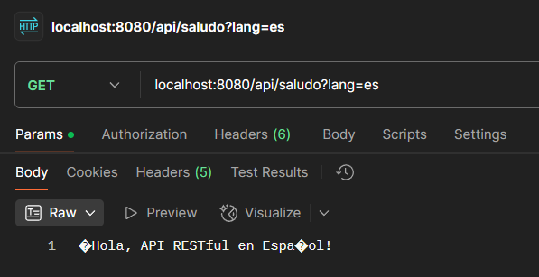
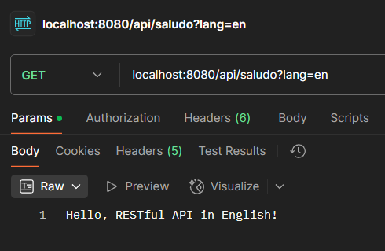
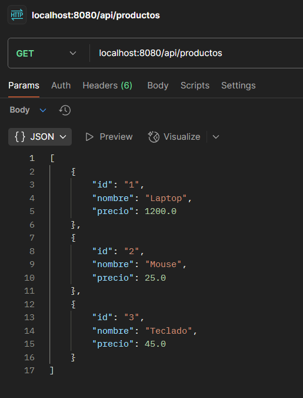
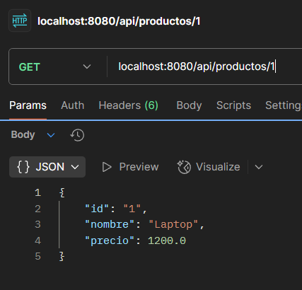
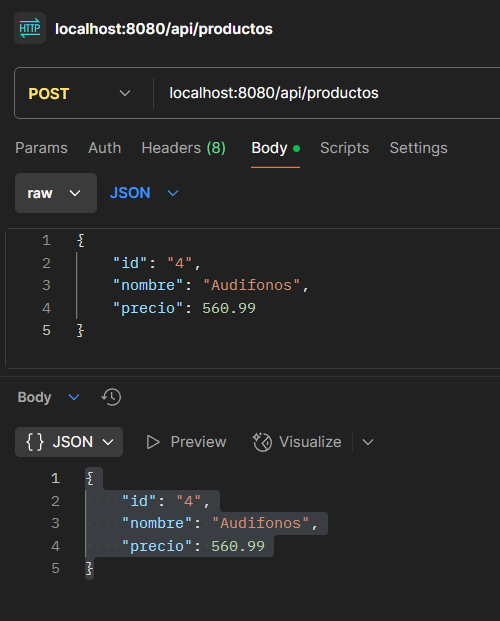
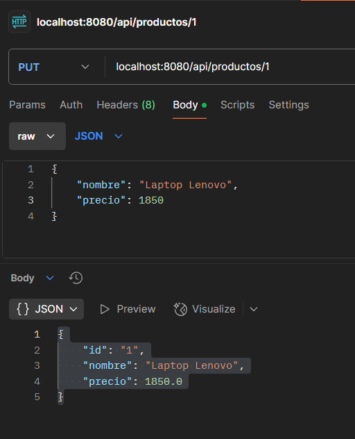
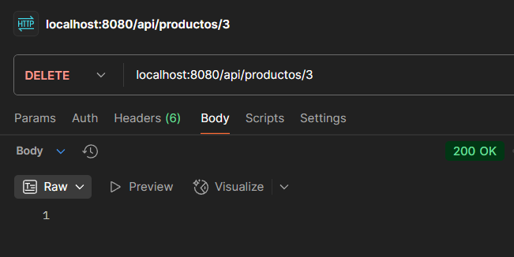
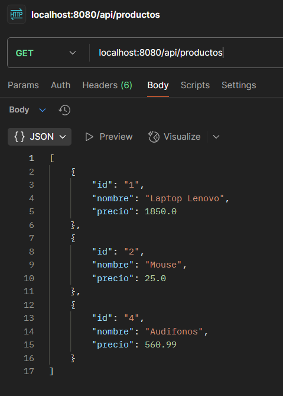

## Instrucciones para ejecutar la aplicación
1. Ingresar al enlace adjunto que lleva al Github donde se encuentra el código, esté se debe descargar.
2. Ingresar a IntelliJ, dar click en "Abrir" y buscar el repositorio.
3. buscar el archivo "ParcialApplication" dentro de src/main/java/com/example.
4. Dar click derecho en el archivo y seleccionar ejecutar "ParcialApplication.Main()"
## Evidencias
Endpoint para ver mensaje en español:
```
curl --location 'localhost:8080/api/saludo?lang=es'
```

Endpoint para ver mensaje en ingles:
```
curl --location 'localhost:8080/api/saludo?lang=en'
```

Endpoint para ver todos los productos disponibles:
```
curl --location 'localhost:8080/api/productos'
```

Endpoint para ver un producto:
```
curl --location 'localhost:8080/api/productos/1'
```

Endpoint para crear un producto:
```
curl --location 'localhost:8080/api/productos' \
--header 'Content-Type: application/json' \
--data '{
"id": "4",
"nombre": "Audifonos",
"precio": 560.99
}'
```

Endpoint para modificar un producto:
```
curl --location --request PUT 'localhost:8080/api/productos/1' \
--header 'Content-Type: application/json' \
--data '{
"nombre": "Laptop Lenovo",
"precio": 1850
}'
```

Endpoint para eliminar un producto:
```
curl --location --request DELETE 'localhost:8080/api/productos/3' \
--data ''
```

Resultado de los cambios:

